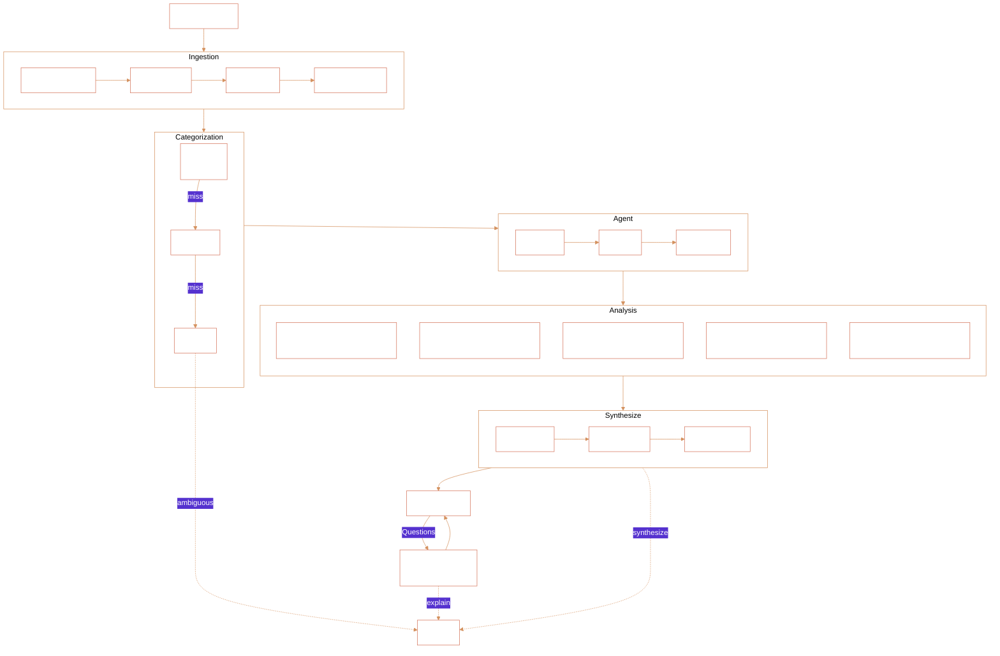

# Sift

Turns bank statements into insights. Runs five statistical tools on your transaction data, skips analyses that don't have enough data, and lets you ask follow-up questions that actually compute instead of guess.

## Pipeline

### Tech
Claude, OpenAI, Gemini, or local Ollama for LLM calls.

## Why This Way

**Rules first** — Merchants are deterministic 70% of the time. Only LLM the ambiguous 30%. At scale (~1M users), saves ~$1.4M/month vs classifying everything.

**Std-dev ranking, not regression** — Linear regression where output = sum of inputs is circular (R² ≈ 1.0 always). Ranking by standard deviation actually measures what's driving variance.

**Bonferroni on correlations** — With N categories, there are N(N-1)/2 pairs to test. No correction = false positive spam. Bonferroni ensures only real correlations surface.

## Human Boundary — What the AI Must Never Decide

Sift's AI sees numbers, not context. It cannot know if someone depends on a subscription for their mental health, or is already food-insecure. The system enforces this boundary at three layers:

1. **Prompt guardrail** — The LLM is explicitly told to never suggest reducing essentials (groceries, rent, healthcare, utilities, childcare, education, insurance).
2. **Computation whitelist** — `generate_savings_plan()` only targets discretionary categories (dining, shopping, entertainment, etc.). Essentials are structurally excluded from savings recommendations.
3. **Post-generation filter** — `validate_insight_framing()` rejects any insight that slips through and suggests cutting an essential category.

The critical human decision: **whether to actually change spending behavior**. Sift surfaces patterns and options — the human decides what matters in their life.
