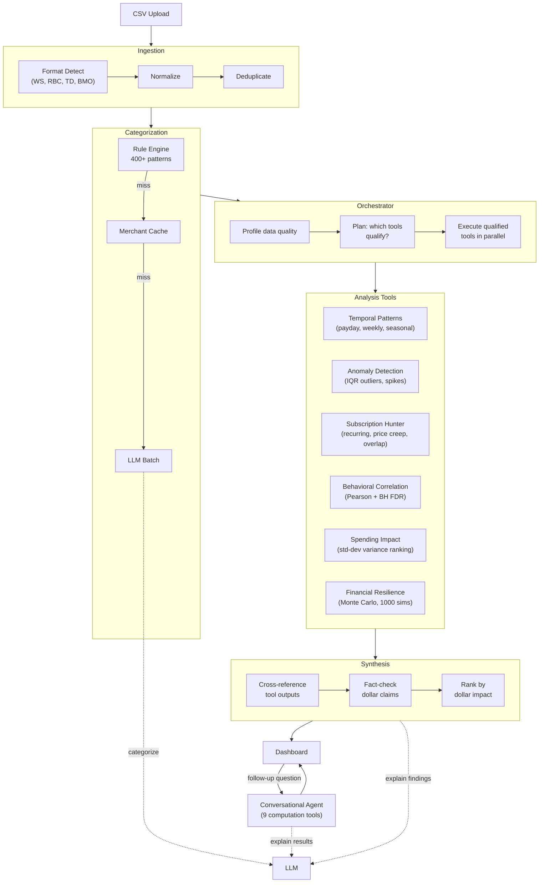
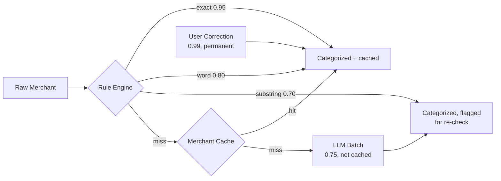

# Sift

Upload a bank CSV. In 15 seconds, get a ranked action plan with dollar amounts, merchant names, and specific next steps. Ask a follow-up and the agent routes to the right computation tool, runs it on your real transactions, and explains the result. The LLM never generates numbers.

## Architecture


```mermaid
flowchart TD
    CSV["CSV Upload"]

    subgraph INGEST["Ingestion"]
        direction LR
        I1["Format Detect<br/>(WS, RBC, TD, BMO)"] --> I2["Normalize"] --> I3["Deduplicate"]
    end

    subgraph CAT["Categorization"]
        direction LR
        C1["Rule Engine<br/>400+ patterns"] -->|miss| C2["Merchant Cache"] -->|miss| C3["LLM Batch"]
    end

    subgraph AGENT["Orchestrator"]
        direction LR
        A1["Profile data quality"] --> A2["Plan: which tools<br/>qualify?"] --> A3["Execute qualified<br/>tools in parallel"]
    end

    subgraph TOOLS["Analysis Tools"]
        T1["Temporal Patterns<br/>(payday, weekly, seasonal)"]
        T2["Anomaly Detection<br/>(IQR outliers, spikes)"]
        T3["Subscription Hunter<br/>(recurring, price creep, overlap)"]
        T4["Behavioral Correlation<br/>(Pearson + BH FDR)"]
        T5["Spending Impact<br/>(std-dev variance ranking)"]
        T6["Financial Resilience<br/>(Monte Carlo, 1000 sims)"]
    end

    subgraph SYNTH["Synthesis"]
        direction LR
        S1["Cross-reference<br/>tool outputs"] --> S2["Fact-check<br/>dollar claims"] --> S3["Rank by<br/>dollar impact"]
    end

    CSV --> INGEST --> CAT --> AGENT --> TOOLS --> SYNTH --> DASH["Dashboard"]
    DASH -->|follow-up question| CONV["Conversational Agent<br/>(9 computation tools)"]
    CONV --> DASH

    C3 -.->|categorize| LLM["LLM"]
    SYNTH -.->|explain findings| LLM
    CONV -.->|explain results| LLM
```

The LLM touches three places: categorizing merchants the rule engine misses, explaining cross-tool findings, and writing up computation results for follow-up questions. It never generates numbers.

## Agent, Not a Fixed Pipeline

The orchestrator profiles your data first: how many months, how many categories, whether income is present. Then it decides which tools can produce reliable output. Each tool has hard minimums the LLM cannot override:

| Tool | Minimum Required | Reasoning |
|---|---|---|
| Anomaly Detection | No minimum | IQR is robust at any sample size |
| Subscription Hunter | 50 transactions | Needs enough cycles to separate recurring from one-off |
| Temporal Patterns | 90 days | Payday detection needs 3+ pay periods |
| Behavioral Correlation | 90 days, 3 categories | Pearson needs variance across multiple months |
| Spending Impact | 180 days, 5 categories | Std-dev ranking needs enough spread to be meaningful |
| Financial Resilience | 90 days, 3 categories | Monte Carlo needs monthly distributions to simulate |

If your data can't support a reliable result, the tool gets skipped and the agent tells you why. Qualified tools run in parallel via `ThreadPoolExecutor`, capped at 4 workers.

## Categorization Cascade

"STARBUCKS" doesn't need an LLM. The rule engine handles it at 0.95 confidence with zero latency and zero cost. The harder problem is "SP * ETSY" or "AMZ*WHOLEFDS". Those go to the LLM, but LLM classifications sit at 0.75 confidence, below the 0.80 cache threshold. Intentional. LLM results are useful but not trustworthy enough to propagate without review.


```mermaid
flowchart LR
    M["Raw Merchant"] --> R{"Rule Engine"}
    R -->|"exact 0.95"| DONE["Categorized + cached"]
    R -->|"word 0.80"| DONE
    R -->|"substring 0.70"| FLAG["Categorized, flagged<br/>for re-check"]
    R -->|miss| CACHE{"Merchant Cache"}
    CACHE -->|hit| DONE
    CACHE -->|miss| LLM["LLM Batch<br/>0.75, not cached"]
    LLM --> FLAG

    USER["User Correction<br/>0.99, permanent"] --> DONE
```

At scale: the rule engine costs nothing. LLM fallback costs ~$0.002 per merchant. Classify everything with LLM at 1M users and you're spending ~$1.4M/month. Rules handle 70% for free. LLM only touches the ambiguous 30%.

User corrections lock at 0.99 and permanently override everything. That's the most reliable signal in the system.

## Cross-Tool Synthesis

The synthesizer cross-references results to find compound patterns no single tool can see:

- **Payday timing + spending driver** = "39% of your Shopping happens in the first week after payday." Neither the temporal tool nor the spending impact tool produces this alone.
- **Subscription overlap + price creep** = subscription costs growing from two directions simultaneously. Compounding cost growth invisible when viewed separately.
- **Spending spike + behavioral correlation** = "Your Dining and Delivery tend to rise together." A spike in one looks isolated. Pearson with Benjamini-Hochberg FDR correction reveals they're linked.
- **Financial resilience + spending driver** = "Your savings would last 8 months. Dining is where the swing is." Monte Carlo gives the runway. Spending impact tells you which lever to pull.

These cross-references run as pure computation. The LLM only explains the result afterward.

## Fact-Checking and Computation Separation

When you ask "How long would my savings last?", the conversational agent routes to the Monte Carlo simulator. 1,000 simulations run against your actual spending distributions. The LLM receives the numerical results and writes the explanation.

`_fact_check_dollar_impacts()` runs on every LLM-generated insight. If the LLM claims a dollar amount exceeding 2x the largest verified amount from the tools, it gets capped and confidence is downgraded from HIGH to MEDIUM.

9 computation tools handle follow-up questions: cancellation simulation, category breakdown, period comparison, merchant patterns, what-if scenarios, multi-category analysis, Monte Carlo projection, stress testing, and payday analysis. The LLM picks the right tool. The tool does the math.

## Assumptions I Questioned

**"Normal distributions are good enough for spending simulation."** They're not. Medical bills, car repairs, and holiday spending create fat tails that normal distributions underweight. I chose them anyway because fitting per-category distributions from 6-12 months of consumer data would overfit badly. The p10/p90 confidence intervals partially compensate, but production would need heavier tails.

**"Linear regression for spending impact is correct."** It's not. I built it first, got R² ≈ 1.0, and realized why. When your target variable (total spending) is literally the sum of your features (category totals), regression is circular. Replaced it with direct standard deviation ranking, which measures what it claims to measure: which categories drive the most dollar swing month to month.

**"Bonferroni is the right correction for correlations."** Too conservative. With 10 categories you test 45 pairs. Bonferroni divides alpha by 45 and suppresses real findings. Switched to Benjamini-Hochberg FDR, which controls false discovery rate at 10% while letting genuine patterns through. Combined with requiring |r| >= 0.4, this filters noise without killing signal.

**"Two identical transactions in a day is real. Three is a CSV artifact."** Buying coffee twice at the same place is plausible. Three times with the exact same amount and timestamp is almost always a duplicate import. The number 2 is a judgment call based on observed bank export behavior, not a statistical threshold.

## What Breaks First at Scale

Miscategorization. One wrong label propagates through every tool and every downstream pattern. The anomaly detector flags normal purchases as outliers. The correlation engine finds relationships that don't exist.

Today, confidence scoring gates what gets cached vs. flagged for review. With millions of transactions, the rule engine needs to expand, merchant feedback loops need to close faster, and the LLM fallback needs to be replaced with a fine-tuned classifier. New bank formats cold-start the merchant cache, forcing LLM calls until enough user corrections accumulate.

## Run It

```bash
git clone <repo> && cd Sift
./start.sh
```

Backend on `:5001`, frontend on `:3000`. Upload any Wealthsimple, RBC, TD, or BMO bank CSV. Works with Claude, OpenAI, Gemini, or local Ollama.

```
backend/
  Agent/          orchestrator, synthesizer, conversational agent
  Categorization/ rule engine (400+ patterns), LLM fallback, merchant cache
  Tools/          anomaly, correlation, subscriptions, temporal, Monte Carlo
  LLM/            provider-agnostic client with cost tracking
  Ingestion/      format detection, normalization, deduplication

frontend/         Next.js 15, React 19, hand-drawn SVG charts
```

35 unit tests:

```bash
cd backend && python -m pytest tests/ -v
```
