# Sift — Agentic Spending Intelligence

Analyzes personal transaction data to surface compound insights across five statistical tools. Adapts to your data — skips analyses when data is insufficient, cross-references results across tools, and routes follow-up questions to real computations (not LLM guesses).

## Architecture

```mermaid
flowchart TD
    CSV(["📄 CSV Upload"])

    subgraph INGEST["  Ingestion  "]
        direction LR
        I1["Format<br/>Detect"] --> I2["Normalize"] --> I3["Dedupe"] --> I4["Quality<br/>Score"]
    end

    subgraph CAT["  Categorization  "]
        direction LR
        C1["Rules Engine<br/>70%+ · $0"] -->|miss| C2["Merchant<br/>Cache"] -->|miss| C3["LLM<br/>Fallback"]
    end

    subgraph ORCH["  Agent Orchestrator  "]
        direction LR
        O1["① Profile<br/>Data"] --> O2["② Plan<br/>Tools"] --> O3["③ Execute"]
    end

    subgraph TOOLS["  Statistical Tools  "]
        direction TB
        T1["🕐 Temporal<br/>payday · weekly · seasonal<br/>≥ 90 days"]
        T2["🔍 Anomaly<br/>outliers · spikes · new merchants<br/>no minimum"]
        T3["🔄 Subscriptions<br/>recurring · price creep · overlap<br/>≥ 100 txns"]
        T4["📊 Correlations<br/>Pearson + Bonferroni<br/>≥ 90 days · 3 categories"]
        T5["💡 Spending Impact<br/>std-deviation ranking<br/>≥ 180 days · 5 categories"]
    end

    subgraph SYNTH["  Synthesizer  "]
        direction LR
        S1["Cross-reference<br/>Tools"] --> S2["Rank by<br/>$ Impact"] --> S3["3–5<br/>Insights"]
    end

    subgraph CONV["  Conversational Agent  "]
        direction LR
        Q1["Route<br/>Question"] --> Q2["Run<br/>Computation"] --> Q3["LLM<br/>Explains"]
    end

    LLM(["🤖 LLM Client<br/>Claude · OpenAI · Gemini · Ollama"])

    %% Main pipeline
    CSV --> INGEST --> CAT --> ORCH --> TOOLS --> SYNTH

    %% Conversational loop
    SYNTH -->|insights| DASH(["📱 Dashboard"])
    DASH -->|follow-up question| CONV
    CONV -->|answer| DASH

    %% LLM usage — sparse, dashed
    C3 -.->|categorize ambiguous| LLM
    SYNTH -.->|synthesize insights| LLM
    Q1 -.->|route + explain| LLM

    %% Styles — terracotta as backgrounds, warm cream text
    classDef section fill:#b85c38,stroke:#7a3018,color:#fff5ee
    classDef innernode fill:#f5e0cc,stroke:#c06040,color:#3a1500
    classDef endpoint fill:#e8783a,stroke:#9a3c10,color:#fff5ee
    classDef llmnode fill:#d4944a,stroke:#9a6020,color:#3a1500

    class INGEST,CAT,ORCH,TOOLS,SYNTH,CONV section
    class I1,I2,I3,I4,C1,C2,C3,O1,O2,O3,T1,T2,T3,T4,T5,S1,S2,S3,Q1,Q2,Q3 innernode
    class CSV,DASH endpoint
    class LLM llmnode
```

### Interface

### LLM Providers
Claude, OpenAI, Gemini, local Ollama

## Design Decisions

**Rules-first, not AI-first** — Rules handle 70%+ of merchants at zero cost. LLM only sees genuinely ambiguous cases. With financial analysis scaling (~1M users), ~$1.4M/month saved vs classifying everything with LLM.

**Std ranking over regression for spending impact** — Linear regression where Y = sum of X is tautological (R² always ~1.0). Standard deviation ranking measures variance contribution honestly.

**Bonferroni correction on correlations** — With N categories there are N(N-1)/2 pairs to test. Uncorrected testing inflates false positives. Bonferroni ensures only robust correlations surface.
